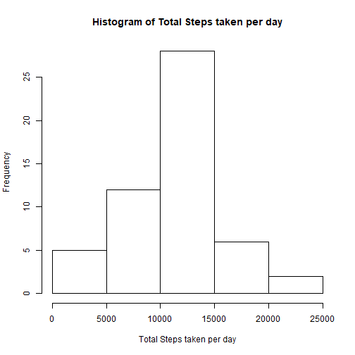

Here is my course project 1.
===============================

##Loading and preprocessing the data.


```r
setwd("D:/datascience/5")
activity <- read.table("activity.csv", sep=",", header=T)
```

##What is mean total number of steps taken per day?

Calculate the total number of steps taken per day.


```r
totalSteps <- aggregate(steps ~ date, data = activity, sum, na.rm = TRUE)
```

Make a histogram of the total number of steps taken each day.


```r
hist(totalSteps$steps,main="Histogram of Total Steps taken per day",xlab="Total Steps taken per day",cex.axis=1,cex.lab = 1)
```



Calculate and report the mean and median of the total number of steps taken per day.


```r
mean_steps <- mean(totalSteps$steps)
median_steps <- median(totalSteps$steps)
```

The mean total number of steps taken per day is 1.0766189 &times; 10<sup>4</sup> steps.
The median total number of steps taken per day is 10765 steps.

##What is the average daily activity pattern?

Make a time series plot of the 5-minute interval (x-axis) and the average number of steps taken, averaged across all days (y-axis).


```r
steps_interval <- aggregate(steps ~ interval, data = activity, mean, na.rm = TRUE)
plot(steps ~ interval, data = steps_interval, type = "l", xlab = "Time Intervals (5-minute)", ylab = "Mean number of steps taken (all Days)", main = "Average number of steps Taken at 5 minute Intervals",  col = "blue")
```


Which 5-minute interval, on average across all the days in the dataset, contains the maximum number of steps?


```r
maxStepInterval <- steps_interval[which.max(steps_interval$steps),"interval"]
```

##Imputing missing values

Calculate and report the total number of missing values in the dataset.


```r
missing <- nrow(activity[is.na(activity),])
```

The total number of missing rows is`missing`.

Devise a strategy for filling in all of the missing values in the dataset.


```r
#This function returns the mean steps for a given interval.
getMeanStepsPerInterval <- function(interval){
    steps_interval[steps_interval$interval==interval,"steps"]
}
```

Create a new dataset that is equal to the original dataset but with the missing data filled in.


```r
complete.activity <- activity
flag = 0
for (i in 1:nrow(complete.activity)) {
    if (is.na(complete.activity[i,"steps"])) {
        complete.activity[i,"steps"] <- getMeanStepsPerInterval(complete.activity[i,"interval"])
        flag = flag + 1
        }
    }
```

Make a histogram of the total number of steps taken each day. 


```r
total.steps.per.days <- aggregate(steps ~ date, data = complete.activity, sum)
hist(total.steps.per.days$steps, col = "blue", xlab = "Total Number of Steps", main = "Histogram of Total Number of Steps taken each Day")
```


Calculate and report the mean and median total number of steps taken per day.


```r
showMean <- mean(total.steps.per.days$steps)
showMedian <- median(total.steps.per.days$steps)
```

Mean total number of steps taken per day is 1.0766189 &times; 10<sup>4</sup>.
Median total number of steps taken per day is 1.0766189 &times; 10<sup>4</sup>.

Do these values differ from the estimates from the first part of the assignment?

The mean value is the same but the median value has changed.

What is the impact of imputing missing data on the estimates of the total daily number of steps?

The mean value is the same as the value before imputing missing data since the mean value has been used for that particular 5-min interval. The median value is different, since the median index is now being changed after imputing missing values.

##Are there differences in activity patterns between weekdays and weekends?


```r
complete.activity$day <- ifelse(as.POSIXlt(as.Date(complete.activity$date))$wday%%6 == 0, "weekend", "weekday")
complete.activity$day <- factor(complete.activity$day, levels = c("weekday", "weekend"))
```

Make a panel plot containing a time series plot of the 5-minute interval (x-axis) and the average number of steps taken, averaged across all weekday days or weekend days (y-axis).


```r
steps.interval= aggregate(steps ~ interval + day, complete.activity, mean)
library(lattice)
xyplot(steps ~ interval | factor(day), data = steps.interval, aspect = 1/2, 
       type = "l")
```


